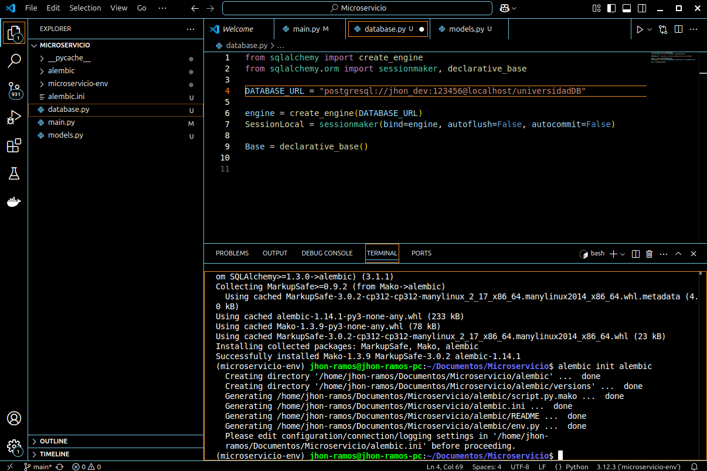
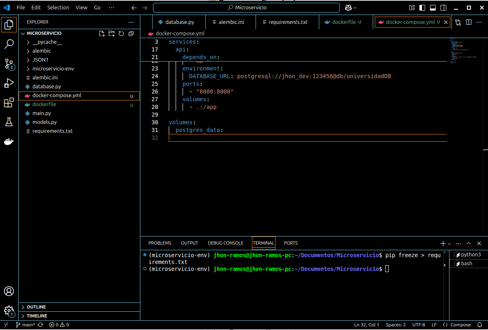

## DOCUMENTACIÓN

# Guía de Pasos

Aquí se muestran las imágenes que explican el proceso paso a paso.

## 📌 Instrucciones con Imágenes

### Paso 1  
_Se crea la carpeta donde se va estar el microservicio y se hace un git init para tener un control de versiones._  

### Paso 2  
_Se crea el entorno virtual y se activa el mismo._  

### Paso 3  
_Instalación de FASTAPI._  

### Paso 4  
_Instalación de uvicorn._  

### Paso 5  
_Se ejecuta una aplicación FASTAPI usando uvicorn, un servidor ASGI._  

### Paso 6  
_Por medio del comando se instalan cuatro paquetes esenciales para desarrollar una API con FastAPI y conectarla a una base de datos PostgreSQL._  
_FASTAPI: Framework web moderno y rápido para construir APIs en Python._  
_UVICORN: Servidor ASGI para ejecutar aplicaciones FastAPI._  
_sqlalchemy: ORM (Object Relational Mapper) que permite interactuar con bases de datos mediante Python en lugar de SQL puro._  
_psycopg2 → Driver que permite a SQLAlchemy conectarse y comunicarse con PostgreSQL._  

### Paso 7  
_Instalación de postgres._  

### Paso 8  
_Creo la base de datos y le doy autoria al usuario jhon_dev._  

### Paso 9  
_Instalo alembic para las migraciones._  

### Paso 10  
_Se ejecuta el comando que inicializa Alembic, una herramienta para gestionar migraciones en bases de datos con SQLAlchemy._  

### Paso 11  
_Se ejecuta el comando que inicializa Alembic, una herramienta para gestionar migraciones en bases de datos con SQLAlchemy._  

### Paso 12  
_Este comando crea un nuevo archivo de migración con los cambios detectados en el modelo de la base de datos definido con SQLAlchemy._  
_alembic revision: Crea un nuevo archivo de migración._ 
_autogenerate: Genera automáticamente los cambios comparando los modelos de SQLAlchemy con la base de datos.._ 
_-m "Inicializar tablas": Agrega un mensaje descriptivo a la migración, facilitando su identificación.._ 

### Paso 13  
_Verificación de la tabla estudiantes._  

### Paso 14  
_Verificación de la tabla profesores._  

### Paso 15  
_GET POSTMAN profesores._  

### Paso 16  
_POST POSTMAN profesores._  

### Paso 17  
_POST POSTMAN estudiantes._  

### Paso 18  
_PUT POSTMAN profesores._  

### Paso 19  
_Confirmación del PUT._  

### Paso 20  
_DELETE POSTMAN estudiantes._  

### Paso 21  
_Confirmación del DELETE._  

### Paso 22  
_Ejecuto el comando para guardar las depencias del programa._  

### Paso 23  
_DOCKERFILE._  

### Paso 24  
_docker-compose.yml._  

### Paso 25  
_docker-compose.yml._  

### Paso 26  
_ Crear mi cuenta en Render y conectarla con git hub._  

### Paso 27  
_Conecto Render con el código subido a mi repositorio._  

### Paso 28  
_ Le asigno un nombre al sitio web._  

### Paso 29  
_ Escribo el build command para la instalación de las dependencias y el start 
command para inicializar la API. Después de esto se ejecuta el programa.._  

### Paso 30  
_ Creo la base de datos que va a conectar con el servicio de Render._  

### Paso 31  
_ Relaciono la base de datos con el servicio dentro del apartado de Enviroment._  

### Paso 32  
_Al darme un error en la conexión con la base de datos, volví a configurar el 
código URL en el database.py y alembic.ini
._  

### Paso 33  
_ Vuelvo a inicializar el programa agregando el comando alembic upgrade head 
para que se hagan las migraciones.._  

### Paso 34  
_ Por ultimo probe con Postman que se pudieran hacer las peticiones de datos._  

